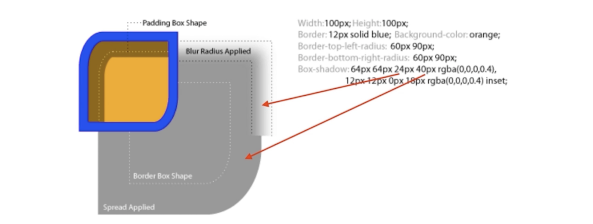

# 效果属性

## box-shadow

### 语法

box-shadow:A B C D color inset

- A : 阴影上下区域偏移大小
- B : 阴影左右区域偏移大小
- C : 阴影模糊区域大小
- D : 阴影包裹区域大小(大于 0 表示放大，小于 0 表示相对元素缩小)
- color 颜色
- inset 表示为内阴影

用“，”间隔，可以做多个投影,组成新的图形

`box-shadow:A B C D color,A1 B1 C1 D1 color1`

### 作用

- 营造层次感
- 充当没有宽度的边框(不算在盒模型中)
- 特殊效果

## text-shadow

### 语法

text-shadow:A B C color

- A 上下偏移
- B 左右偏移
- C 阴影大小
- color 颜色为

### 作用

- 立体感
- 印刷品质感

## border-radius

- 圆角矩形 -> `border-radious:20% 10%`
- 圆形 -> `border-radious:50% 50%`
- 扇形
- 特殊图形

## background

- 纹理、图案
- 渐变
- 雪碧图动画
- 背景图尺寸适应

  - background-size:cover // 全覆盖，不拉伸，不缩放
  - background-size:contain // 图片全展示，但不拉伸，等比缩放，超出部分空白

## clip-path

不变化容器布局以及所占空间

- 对容器进行裁剪
- 常见几何图形
- 自定义裁剪

### 语法

- clip-path:url(svg 对应 ID)// 自定义路径
- clip-path:inset(width,height) // 矩形
- clip-path:circle(圆心，半径) // 圆
- clip-path:polygon(起始点坐标(x,y),中间点坐标(x,y)结束点坐标(x,y)) // 多边形

## 3D 变换

- 变换 transform

  - translate 移动 translateZ ｜ translateX ｜ translateY
  - scale 缩放
  - skew 斜切
  - rotate 2D 旋转 rotateX | rotateY
